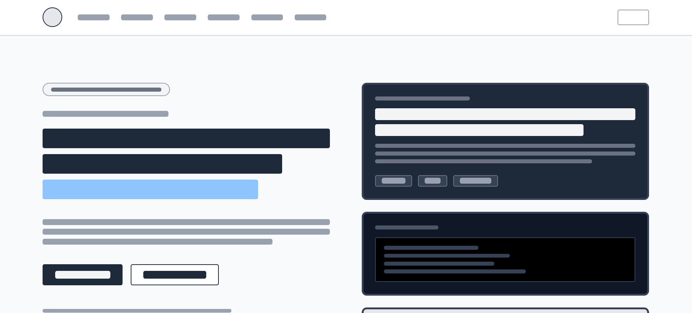

# Wireframe

The wireframe shows the basic structure used across the site: a header with logo and navigation, a main content area, and a footer. It also maps the layout for the intro page, the grid-based product overview, and the supporting content pages.

